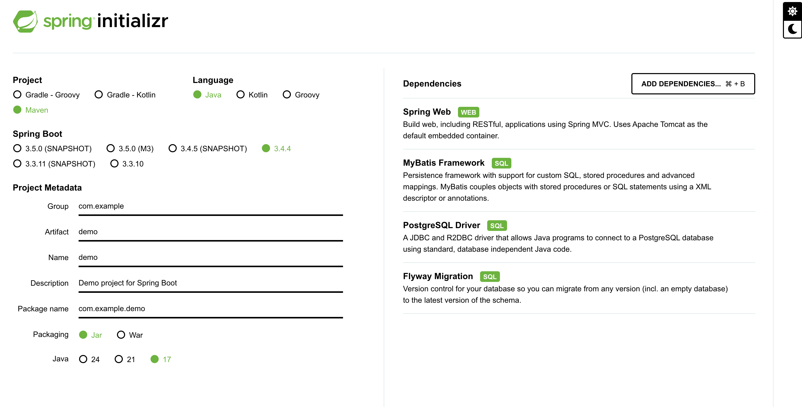

# Todo Demo Application

A simple todo application with Java backend and PostgreSQL database.

## Prerequisites
- Docker Desktop installed
- Java 17 JDK
- Maven

## Getting Started

### Spring Initializr Setup
When creating a new project from https://start.spring.io/, select these dependencies:
- Spring Web
- PostgreSQL Driver
- Flyway Migration
- MyBatis Framework
- Spring Boot DevTools (optional for development)



### Docker Setup
1. Install Docker Desktop:
   - Download from [Docker website](https://www.docker.com/products/docker-desktop)
   - Follow installation instructions for your OS

2. Start the database and services:
```bash
docker-compose up -d db
```

3. Start the backend:
```bash
docker-compose up -d backend
```

4. Start the frontend (from frontend directory):
```bash
cd frontend && npm install && npm start
```

The application should be accessible at `http://localhost:3000`

## Backend Development
Key dependencies in use:
- Spring Boot 3.4.4
- Flyway for database migrations
- MyBatis for SQL mapping
- PostgreSQL JDBC driver


this is the line I added

